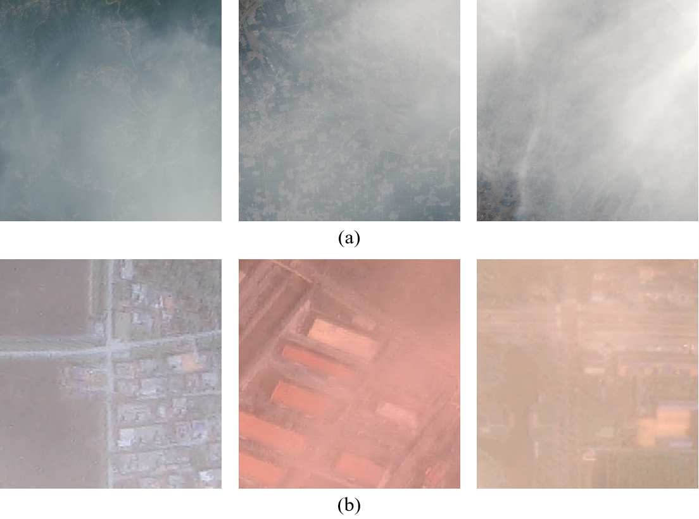

# Real-World Remote Sensing Image Dehazing: Benchmark and Baseline


This is the official Pytorch/Pytorch implementation of the paper: <br/>
> **Real-World Remote Sensing Image Dehazing: Benchmark and Baseline**
>
> Zeng-Hui Zhu†, Wei Lu†, Si-Bao Chen*, Chris H. Q. Ding, Jin Tang, and Bin Luo, Senior Member, IEEE 
> 
>  *IEEE Transactions on Geoscience and Remote Sensing (TGRS), In peer review.* [arXiv](https://arxiv.org/abs/2503)
> 

---

<p align="center"> 

<p align="center">  Visual comparison of synthetic and real-world RS hazy images. (a) Synthetic hazy images from the RS-HAZE dataset. (b) Real-world hazy images from our RRSHID dataset, highlighting complex color variations.
</p> 

----


<details>
  <summary>
  <font size="+1">Abstract</font>
  </summary>
Remote Sensing Image Dehazing (RSID) poses significant challenges in real-world scenarios due to the complex atmospheric conditions and severe color distortions that degrade image quality. The scarcity of real-world remote sensing hazy image pairs has compelled existing methods to rely primarily on synthetic datasets. However, these methods struggle with real-world applications due to the inherent domain gap between synthetic and real data. To address this, we introduce Real-World Remote Sensing Hazy Image Dataset (RRSHID), the first large-scale dataset featuring real-world hazy and dehazed image pairs across diverse atmospheric conditions. Based on this, we propose MCAF-Net, a novel framework tailored for real-world RSID. Its effectiveness arises from three innovative components: Multi-branch Feature Integration Block Aggregator (MFIBA), which enables robust feature extraction through cascaded integration blocks and parallel multi-branch processing; Color-Calibrated Self-Supervised Attention Module (CSAM), which mitigates complex color distortions via self-supervised learning and attention-guided refinement; and Multi-Scale Feature Adaptive Fusion Module (MFAFM), which integrates features effectively while preserving local details and global context. Extensive experiments validate that MCAF-Net demonstrates state-of-the-art performance in real-world RSID, while maintaining competitive performance on synthetic datasets. The introduction of RRSHID and MCAF-Net sets new benchmarks for real-world RSID research, advancing practical solutions for this complex task.
</details>


## Introduction

The code will be available.

The dataset can be downloaded [here](https://pan.baidu.com/s/1Wg3u7V8AOVfgqkaw1n3lEg?pwd=CV21). Password: CV21


## Star History

[](https://www.star-history.com/)


If you have any questions about this work, you can contact me. Email: luwei_ahu@qq.com.

Your star is the power that keeps us updating github.

## Citation
If RRSHID is useful or relevant to your research, please kindly recognize our contributions by citing our paper:
```
@article{lu2025legnet,
  title={Real-World Remote Sensing Image Dehazing: Benchmark and Baseline},
  author={Zhu, Zeng-Hui and Lu, Wei and Chen, Si-Bao and Ding, Chris HQ and Tang, Jin and Luo, Bin},
  journal={arXiv preprint arXiv:2503},
  year={2025}
}
```

## License
Licensed under a [Creative Commons Attribution-NonCommercial 4.0 International](https://creativecommons.org/licenses/by-nc/4.0/) for Non-commercial use only.
Any commercial use should get formal permission first.
